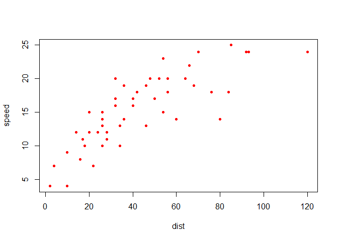

Sample github\_document
================
Zhenguo Zhang
03 February, 2021

  - [Requirements](#requirements)
  - [The document](#the-document)
  - [Compile to github\_document](#compile-to-github_document)
  - [Options for github\_document](#options-for-github_document)
  - [References](#references)

In this demo, we shows how to create a github-flavored markdown
document, which can be viewed as html at github directly.

## Requirements

<<<<<<< HEAD
  - latest [*rmarkdown*](https://rmarkdown.rstudio.com/) package: the
    *github\_document* format is only available in recent *rmarkdown*
    package.
=======
  - latest (*rmarkdown*)\[<https://rmarkdown.rstudio.com/>\] package:
    the *github\_document* format is only available in recent
    *rmarkdown* package.
>>>>>>> af399f27462052ea9540a4a17df93f3ba7cd7544

## The document

Here we go. Nothing is special when creating github\_document, just
write the document as writing html\_document, and *rmarkdown::render()*
will take care of the rest.

Here we create a plot using the builtin data *cars*:

``` r
with(cars, plot(speed ~ dist, pch=20, col="red"))
```



## Compile to github\_document

When a Rmarkdown document is complete, use *rmarkdown::render()* or the
“Knit” button to generate the output markdown document. This yields a
markdown file with *.md* extension as well as a folder containing
elements for the document such as generated figures.

Push the markdown as well as associated folder to github and then you
can view this markdown file at github.

## Options for github\_document

Here are useful options can be put in the YAML header to tune the
outlook of the github document.

| Option         | Values                                | Explanation                                                           |
| -------------- | ------------------------------------- | :-------------------------------------------------------------------- |
| html\_preview  | true, false                           | if false, suppress html preview                                       |
| toc            | true, false                           | if false, no table of contents                                        |
| toc\_depth     | integer                               | default 3, the depth of sections in TOC                               |
| fig\_width     | float                                 | default 7, the width of output figures                                |
| fig\_height    | float                                 | default 5, the height of output figures                               |
| dev            | jpeg, png, etc                        | default png, device for figure output.                                |
| includes       | in\_header, before\_body, after\_body | include other markdown files in header, before or after document body |
| md\_extensions | \+pandoc\_opt, -pandoc\_opt           | enable/disable pandoc extensions                                      |
| pandoc\_args   | \[“–opt”,“value”\]                    | use pandoc options directly                                           |

To share options among multiple markdown documents in a directory, one
can put these options into file \*\_output.yaml\*.

Have fun\!

## References

1.  <https://rmarkdown.rstudio.com/github_document_format.html>
