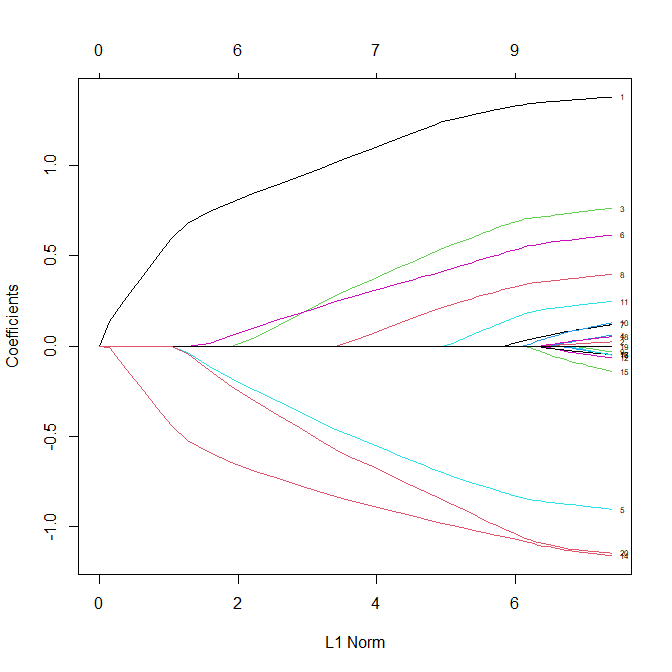
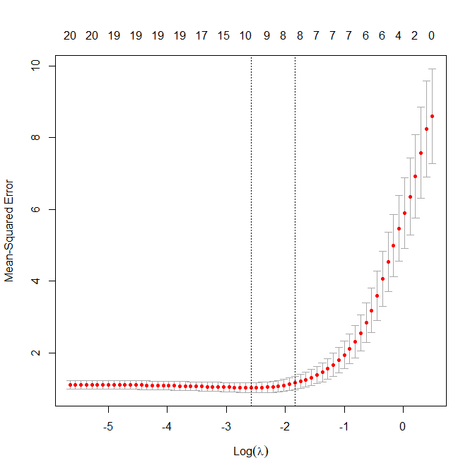
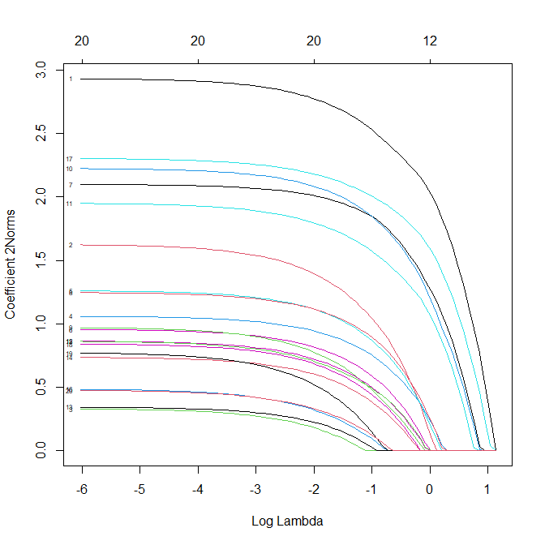
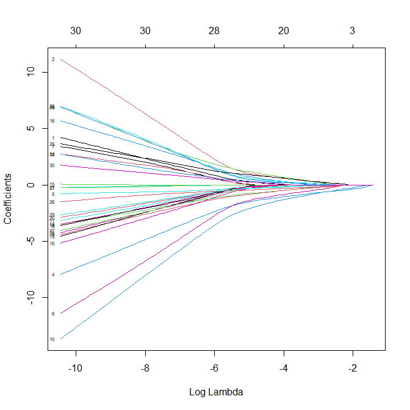
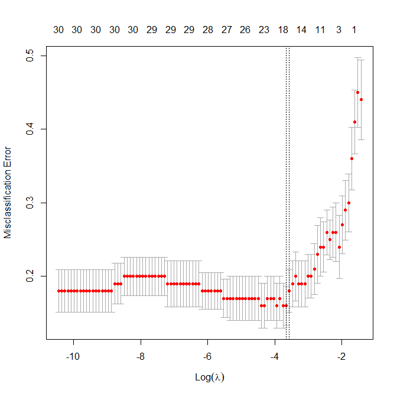
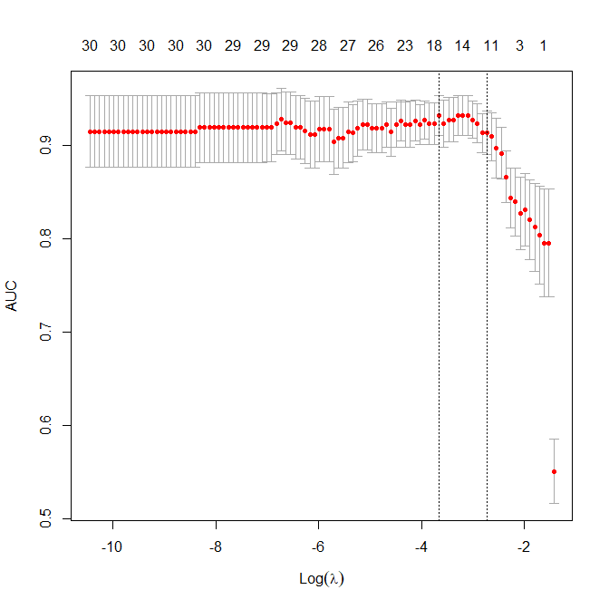
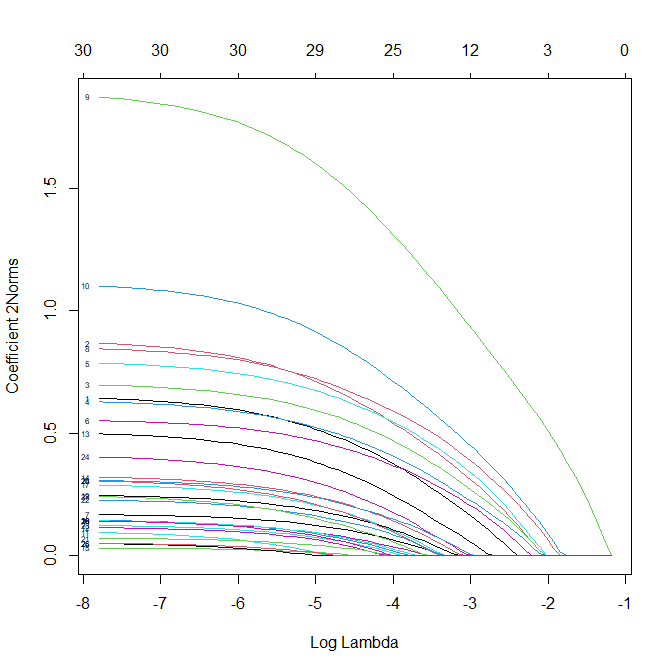
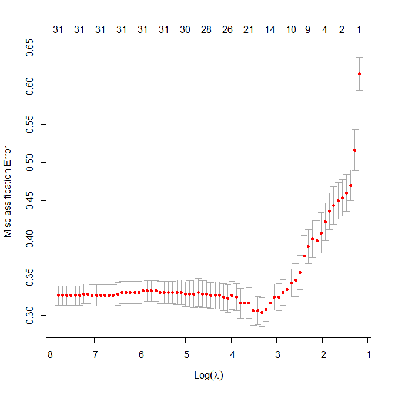
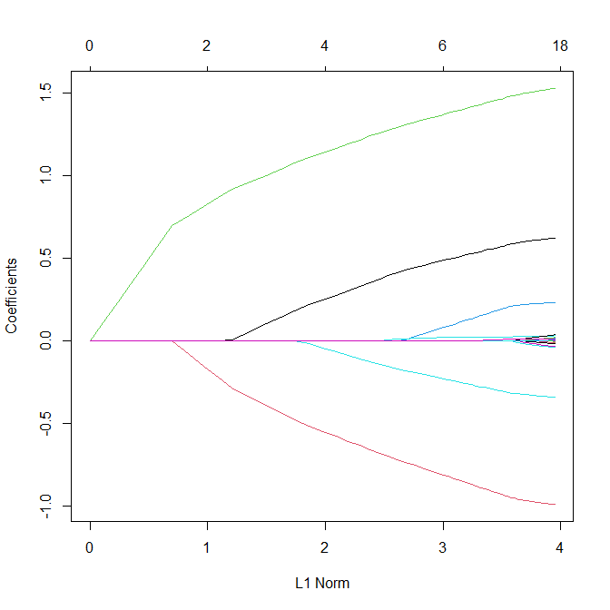

A tutorial on glmnet
================
Zhenguo Zhang
04 January, 2025

-   [Statistical models](#statistical-models)
    -   [Guassian linear model](#guassian-linear-model)
    -   [Multi-response guassian
        family](#multi-response-guassian-family)
    -   [Logistic regression model](#logistic-regression-model)
    -   [Multinomial model](#multinomial-model)
    -   [Poisson regression model](#poisson-regression-model)
-   [Assessing models](#assessing-models)
-   [Parameters](#parameters)
    -   [Function *glmnet*](#function-glmnet)
    -   [Function *predict*](#function-predict)
    -   [Function *plot*](#function-plot)
    -   [Function *cv.glmnet*](#function-cvglmnet)
    -   [Other functions](#other-functions)

## Statistical models

In addition to the models show below, one can also specify other more
generalized model in any GLM family by the function *family()*.

### Guassian linear model

``` r
data(QuickStartExample)
x <- QuickStartExample$x
y <- QuickStartExample$y
```

where x is matrix with dimension 100, 20 and y is a one-column matrix
with response. And we fit a linear model using the following:

``` r
fit<-glmnet(x,y)
```

We can plot the coefficient of each variable against the L1 norm (sum of
all the absolute values of coefficients) when $\lambda$ varies as
follows:

``` r
plot(fit, label=T)
```

<!-- -->

Each line represents a variable (total 20 variables), and it shows that
when the the L1 Norm changes (driven by $\ambda$ changes), how the
coefficients change.

To show how the modeling goes along with the changes of $\lambda$, one
can print out the fitted object:

``` r
print(fit)
```

    ## 
    ## Call:  glmnet(x = x, y = y) 
    ## 
    ##    Df  %Dev  Lambda
    ## 1   0  0.00 1.63100
    ## 2   2  5.53 1.48600
    ## 3   2 14.59 1.35400
    ## 4   2 22.11 1.23400
    ## 5   2 28.36 1.12400
    ## 6   2 33.54 1.02400
    ## 7   4 39.04 0.93320
    ## 8   5 45.60 0.85030
    ## 9   5 51.54 0.77470
    ## 10  6 57.35 0.70590
    ## 11  6 62.55 0.64320
    ## 12  6 66.87 0.58610
    ## 13  6 70.46 0.53400
    ## 14  6 73.44 0.48660
    ## 15  7 76.21 0.44330
    ## 16  7 78.57 0.40400
    ## 17  7 80.53 0.36810
    ## 18  7 82.15 0.33540
    ## 19  7 83.50 0.30560
    ## 20  7 84.62 0.27840
    ## 21  7 85.55 0.25370
    ## 22  7 86.33 0.23120
    ## 23  8 87.06 0.21060
    ## 24  8 87.69 0.19190
    ## 25  8 88.21 0.17490
    ## 26  8 88.65 0.15930
    ## 27  8 89.01 0.14520
    ## 28  8 89.31 0.13230
    ## 29  8 89.56 0.12050
    ## 30  8 89.76 0.10980
    ## 31  9 89.94 0.10010
    ## 32  9 90.10 0.09117
    ## 33  9 90.23 0.08307
    ## 34  9 90.34 0.07569
    ## 35 10 90.43 0.06897
    ## 36 11 90.53 0.06284
    ## 37 11 90.62 0.05726
    ## 38 12 90.70 0.05217
    ## 39 15 90.78 0.04754
    ## 40 16 90.86 0.04331
    ## 41 16 90.93 0.03947
    ## 42 16 90.98 0.03596
    ## 43 17 91.03 0.03277
    ## 44 17 91.07 0.02985
    ## 45 18 91.11 0.02720
    ## 46 18 91.14 0.02479
    ## 47 19 91.17 0.02258
    ## 48 19 91.20 0.02058
    ## 49 19 91.22 0.01875
    ## 50 19 91.24 0.01708
    ## 51 19 91.25 0.01557
    ## 52 19 91.26 0.01418
    ## 53 19 91.27 0.01292
    ## 54 19 91.28 0.01178
    ## 55 19 91.29 0.01073
    ## 56 19 91.29 0.00978
    ## 57 19 91.30 0.00891
    ## 58 19 91.30 0.00812
    ## 59 19 91.31 0.00739
    ## 60 19 91.31 0.00674
    ## 61 19 91.31 0.00614
    ## 62 20 91.31 0.00559
    ## 63 20 91.31 0.00510
    ## 64 20 91.31 0.00464
    ## 65 20 91.32 0.00423
    ## 66 20 91.32 0.00386
    ## 67 20 91.32 0.00351

where the first column shows the number of non-zero coefficients (df),
the percentage of deviance explained by the model and the corresponding
$\lambda$. By default, glmnet fits models by using 100 values of
$\lambda$, but stops when the deviance changes from one $\lambda$ to the
next is negligible. According to the default internal settings, the
computations stop if either the fractional change in deviance down the
path is less than 10^-5 or the fraction of explained deviance reaches
0.999

To get the coefficients for the model at a certain $\lambda$, one can
run ($\lambda$ is given using the parameter *s*):

``` r
coef(fit, s=0.2)
```

    ## 21 x 1 sparse Matrix of class "dgCMatrix"
    ##                      s1
    ## (Intercept)  0.15930114
    ## V1           1.26236281
    ## V2           .         
    ## V3           0.57221670
    ## V4           .         
    ## V5          -0.72945780
    ## V6           0.43881523
    ## V7           .         
    ## V8           0.24115125
    ## V9           .         
    ## V10          .         
    ## V11          0.02948022
    ## V12          .         
    ## V13          .         
    ## V14         -0.99916247
    ## V15          .         
    ## V16          .         
    ## V17          .         
    ## V18          .         
    ## V19          .         
    ## V20         -0.88870647

Note that if the given $\lambda$ was not used in the fitting, then
glmnet will calculate by linear interpolating nearby $\lambda$s, unless
the parameter *exact=TRUE* is specified. Note that with *exact = TRUE*,
one has to supply by named argument any data that was used in creating
the original fit, in this case x and y, because refittings will happen
at the specified lambda, like:

``` r
coef(fit, s=0.2, exact=TRUE, x=x, y=y)
```

To predict new values by using models at certain $\lambda$, we can do
the following:

``` r
set.seed(123)
newX<-matrix(rnorm(10*20), ncol=20)
predict(fit, newx = newX, s=c(0.1,0.2))
```

    ##                s1         s2
    ##  [1,] -2.61675297 -2.3146053
    ##  [2,] -0.99533444 -0.8287165
    ##  [3,]  2.67281118  2.5541079
    ##  [4,] -0.22551828 -0.1137858
    ##  [5,]  1.94989813  2.0070995
    ##  [6,]  0.06845953  0.1845563
    ##  [7,]  1.58071214  1.6685619
    ##  [8,] -0.86290322 -0.7238234
    ##  [9,] -3.48835740 -3.2054650
    ## [10,]  3.42799711  2.9595666

Normally, glmnet returns many models for users, to choose one, we can
use cross-validation, and *cv.glmnet* is the function which can be used
to achieve this:

``` r
cvfit<-cv.glmnet(x,y)
```

This function returns an object, containing all the components of
cross-validated fits. To show how the cross-validation errors change
over $\lambda$, one can plot it:

``` r
plot(cvfit)
```

<!-- -->

in which, two dashed vertical lines mark *lambda.min* and *lambda.1se*,
where the lambda values give the minimum cross-validation error and that
within one standard error of the minimum, respectively.

To get the coefficients of the model with minimum $\lambda$, run the
following

``` r
coef(cvfit, s = "lambda.min")
```

    ## 21 x 1 sparse Matrix of class "dgCMatrix"
    ##                      s1
    ## (Intercept)  0.14867414
    ## V1           1.33377821
    ## V2           .         
    ## V3           0.69787701
    ## V4           .         
    ## V5          -0.83726751
    ## V6           0.54334327
    ## V7           0.02668633
    ## V8           0.33741131
    ## V9           .         
    ## V10          .         
    ## V11          0.17105029
    ## V12          .         
    ## V13          .         
    ## V14         -1.07552680
    ## V15          .         
    ## V16          .         
    ## V17          .         
    ## V18          .         
    ## V19          .         
    ## V20         -1.05278699

### Multi-response guassian family

This model is specified by using the parameter *family=“mgaussian”*. And
the respone variable is not a vector, but a matrix with each column
corresponding to one response variable.

``` r
data(MultiGaussianExample)
x <- MultiGaussianExample$x
y <- MultiGaussianExample$y
mfit <- glmnet(x, y, family = "mgaussian")
```

Here x and y have dimensions 100, 20 and 100, 4, respectively.

To plot the coefficients’ L2-Norm (note for each variable, the
coefficients are a vector corresponding to each response variable) over
lambda, one can run the following:

``` r
plot(mfit, xvar = "lambda", label = TRUE, type.coef = "2norm")
```

<!-- -->

We can extract coefficients and other predictions as usual:

``` r
predict(mfit, newx = x[1:5,], s = c(0.1, 0.01))
```

    ## , , 1
    ## 
    ##              y1         y2         y3       y4
    ## [1,] -4.7106263 -1.1634574  0.6027634 3.740989
    ## [2,]  4.1301735 -3.0507968 -1.2122630 4.970141
    ## [3,]  3.1595229 -0.5759621  0.2607981 2.053976
    ## [4,]  0.6459242  2.1205605 -0.2252050 3.146286
    ## [5,] -1.1791890  0.1056262 -7.3352965 3.248370
    ## 
    ## , , 2
    ## 
    ##              y1         y2         y3       y4
    ## [1,] -4.6415158 -1.2290282  0.6118289 3.779521
    ## [2,]  4.4712843 -3.2529658 -1.2572583 5.266039
    ## [3,]  3.4735228 -0.6929231  0.4684037 2.055574
    ## [4,]  0.7353311  2.2965083 -0.2190297 2.989371
    ## [5,] -1.2759930  0.2892536 -7.8259206 3.205211

### Logistic regression model

This model is specified with parameter *family=“binomial”*.

The objective function for logistic regression is the penalized negative
binomial log-likelihood.

For binomial logistic regression, the response variable y should be
either a binary vector, a factor with two levels, or a two-column matrix
of counts or proportions.

``` r
data(BinomialExample)
x <- BinomialExample$x
y <- BinomialExample$y
```

The values of y has the following distribution:

``` r
kable(table(y))
```

| y   | Freq |
|:----|-----:|
| 0   |   44 |
| 1   |   56 |

``` r
fit <- glmnet(x, y, family = "binomial")
plot(fit, xvar="lambda", label=T)
```

<!-- -->

The predictions of class labels and probabilities are as follows:

``` r
predict(fit, newx = x[1:5,], type = "class", s = c(0.05, 0.01))
```

    ##      s1  s2 
    ## [1,] "0" "0"
    ## [2,] "1" "1"
    ## [3,] "1" "1"
    ## [4,] "0" "0"
    ## [5,] "1" "1"

``` r
predict(fit, newx = x[1:5,], type = "response", s = c(0.05, 0.01))
```

    ##             s1         s2
    ## [1,] 0.2689339 0.08690297
    ## [2,] 0.8635933 0.99243736
    ## [3,] 0.6246999 0.79304413
    ## [4,] 0.1868937 0.02786387
    ## [5,] 0.6409280 0.77594232

And the coefficients

``` r
predict(fit, newx = x[1:5,], type = "coefficients", s = c(0.05, 0.01))
```

    ## 31 x 2 sparse Matrix of class "dgCMatrix"
    ##                      s1           s2
    ## (Intercept)  0.20679667  0.208053336
    ## V1           .           0.155759710
    ## V2           0.27556586  0.817930902
    ## V3          -0.16229700 -0.654411766
    ## V4          -0.68944280 -1.301248267
    ## V5          -0.07571269 -0.252512178
    ## V6          -0.41849772 -1.141850588
    ## V7           .           .          
    ## V8          -0.22060982 -0.701222033
    ## V9           0.22281024  0.959156887
    ## V10         -0.73239835 -1.752951977
    ## V11          .          -0.080711983
    ## V12          .          -0.123964021
    ## V13          .          -0.001219085
    ## V14          .           .          
    ## V15          .           .          
    ## V16          .           0.538584916
    ## V17          .           .          
    ## V18          .          -0.154292194
    ## V19          .          -0.044937723
    ## V20          .          -0.084005570
    ## V21          .           .          
    ## V22          0.10250240  0.251623817
    ## V23          0.08116106  0.445062980
    ## V24          .          -0.063981163
    ## V25          0.26375055  0.782672216
    ## V26         -0.15781747 -0.395732774
    ## V27          .          -0.195474276
    ## V28          .           0.350013710
    ## V29         -0.02549764 -0.267369421
    ## V30          .           0.176673190

When using *cv.glmnet*, the parameter *type.measure* has the following
meanings:

-   “mse” uses squared loss.
-   “deviance” uses actual deviance, different from linear guassian
    models
-   “mae” uses mean absolute error.
-   “class” gives misclassification error.
-   “auc” (for two-class logistic regression ONLY) gives area under the
    ROC curv

First, use misclassification error as criterion for cross-validation,

``` r
cvfit <- cv.glmnet(x, y, family = "binomial", type.measure = "class")
plot(cvfit)
```

<!-- -->

And then try using AUC as criterion:

``` r
cvfit <- cv.glmnet(x, y, family = "binomial", type.measure = "auc")
plot(cvfit)
```

<!-- -->

### Multinomial model

This model is specified by providing *family=“multinomial”*. It extends
the binomial model by allowing classes of more than two.

``` r
data(MultinomialExample)
x <- MultinomialExample$x
y <- MultinomialExample$y
```

The values of y has the following distribution:

``` r
kable(table(y))
```

| y   | Freq |
|:----|-----:|
| 1   |  142 |
| 2   |  174 |
| 3   |  184 |

``` r
fit <- glmnet(x, y, family = "multinomial", type.multinomial = "grouped")
plot(fit, xvar = "lambda", label = TRUE, type.coef = "2norm")
```

<!-- -->

Here the parameter *type.multinomial* determine whether grouped lasso
penalty can be used in the model or not, which also depends on another
parameter *q*.

And the cross-validation implementation looks like this:

``` r
cvfit <- cv.glmnet(x, y, family = "multinomial", type.multinomial = "grouped", type.measure = "class")
plot(cvfit)
```

<!-- -->

### Poisson regression model

This model is activated via the parameter *family = “poisson”*.

Like Gaussian and binomial models, Poisson model is a member of
exponential family distribution, so its objective function is to
maximize log-likelihood of the observations.

Now let’s see an example:

``` r
data(PoissonExample)
x <- PoissonExample$x
y <- PoissonExample$y
```

And the counts of each y value is as follows:

``` r
table(y)
```

    ## y
    ##   0   1   2   3   4   5   6   7   8   9  10  11  12  13  14  16  17  18  19  20 
    ## 219  85  47  25  18  10   9   8  12   3   4   3   4   1   4   3   1   3   1   1 
    ##  23  24  25  26  30  32  34  39  40  45  47  48  49  51  52  53  55  56  62  89 
    ##   3   3   2   2   1   3   2   3   1   1   1   2   1   1   1   1   1   1   1   1 
    ##  99 105 150 238 246 322 395 
    ##   1   1   1   1   1   1   1

The fit of the model is as follows

``` r
fit <- glmnet(x, y, family = "poisson")
plot(fit)
```

<!-- -->

Note that one can specify a parameter *offset* with the length equal to
the number of observations to account for the time, area, etc when
sampling Poisson variables. Check the function for more details.

For prediction, when *type=“response”*, the returned value are fitted
mean,

``` r
predict(fit, newx = x[1:5,], type = "response", s = c(0.1,1))
```

    ##              s1         s2
    ## [1,]  2.4944232  4.4263365
    ## [2,] 10.3513120 11.0586174
    ## [3,]  0.1179704  0.1781626
    ## [4,]  0.9713412  1.6828778
    ## [5,]  1.1133472  1.9934537

## Assessing models

*glmnet* provides helpful functions for one to calculate performance
measures along different lambda values, such as

-   *assess.glmnet*: produces all the different performance measures
    provided by cv.glmnet for each of the model families. For
    cross-validation objects, it reports the performance at the optimal
    lambda value (default is lambda.1se); and one can provide different
    lambda values using the parameter *s*.
-   *roc.glmnet*: produces for a single vector a two column matrix with
    columns TPR and FPR (true positive rate and false positive rate). If
    more than one prediction are provided, then a list of such matrix is
    returned. It can accept both predicted values and fitted glmnet
    models
-   *confusion.glmnet*: produces a confusion matrix tabulating the
    classification results

Users can find the measures for each model by using the function
*glmnet.measures()*:

``` r
glmnet.measures()
```

    ## $gaussian
    ## [1] "mse" "mae"
    ## 
    ## $binomial
    ## [1] "deviance" "class"    "auc"      "mse"      "mae"     
    ## 
    ## $poisson
    ## [1] "deviance" "mse"      "mae"     
    ## 
    ## $cox
    ## [1] "deviance" "C"       
    ## 
    ## $multinomial
    ## [1] "deviance" "class"    "mse"      "mae"     
    ## 
    ## $mgaussian
    ## [1] "mse" "mae"
    ## 
    ## $GLM
    ## [1] "deviance" "mse"      "mae"

Here are some examples:

``` r
data(BinomialExample)
x <- BinomialExample$x
y <- BinomialExample$y
itrain <- 1:70
fit <- glmnet(x[itrain, ], y[itrain], family = "binomial", nlambda = 5)
assess.glmnet(fit, newx = x[-itrain, ], newy = y[-itrain])
```

    ## $deviance
    ##        s0        s1        s2        s3        s4 
    ## 1.3877348 0.8612331 1.7948439 3.0335905 3.6930687 
    ## attr(,"measure")
    ## [1] "Binomial Deviance"
    ## 
    ## $class
    ##        s0        s1        s2        s3        s4 
    ## 0.4666667 0.1666667 0.2333333 0.1666667 0.1666667 
    ## attr(,"measure")
    ## [1] "Misclassification Error"
    ## 
    ## $auc
    ## [1] 0.5000000 0.9062500 0.8482143 0.8169643 0.8303571
    ## attr(,"measure")
    ## [1] "AUC"
    ## 
    ## $mse
    ##        s0        s1        s2        s3        s4 
    ## 0.5006803 0.2529304 0.3633411 0.3514574 0.3500440 
    ## attr(,"measure")
    ## [1] "Mean-Squared Error"
    ## 
    ## $mae
    ##        s0        s1        s2        s3        s4 
    ## 0.9904762 0.5114320 0.4597047 0.3928790 0.3767338 
    ## attr(,"measure")
    ## [1] "Mean Absolute Error"

For the second lambda value at 0.0249949, the roc.glmnet function
returns the following matrix:

``` r
roc.glmnet(fit, newx = x[-itrain, ], newy = y[-itrain])[[2]]
```

    ##           FPR    TPR
    ## 1  0.00000000 0.0625
    ## 2  0.00000000 0.1250
    ## 3  0.00000000 0.1875
    ## 4  0.00000000 0.2500
    ## 5  0.00000000 0.3125
    ## 6  0.00000000 0.3750
    ## 7  0.00000000 0.4375
    ## 8  0.00000000 0.5000
    ## 9  0.00000000 0.5625
    ## 10 0.00000000 0.6250
    ## 11 0.00000000 0.6875
    ## 12 0.07142857 0.6875
    ## 13 0.07142857 0.7500
    ## 14 0.14285714 0.7500
    ## 15 0.14285714 0.8125
    ## 16 0.14285714 0.8750
    ## 17 0.21428571 0.8750
    ## 18 0.28571429 0.8750
    ## 19 0.35714286 0.8750
    ## 20 0.35714286 0.9375
    ## 21 0.42857143 0.9375
    ## 22 0.50000000 0.9375
    ## 23 0.57142857 0.9375
    ## 24 0.64285714 0.9375
    ## 25 0.71428571 0.9375
    ## 26 0.78571429 0.9375
    ## 27 0.78571429 1.0000
    ## 28 0.85714286 1.0000
    ## 29 0.92857143 1.0000
    ## 30 1.00000000 1.0000

And similarly, we can also return the confusion matrix for the 2nd
lambda:

``` r
tb<-confusion.glmnet(fit, newx = x[-itrain, ], newy = y[-itrain])[[2]]
print(tb)
```

    ##          True
    ## Predicted  0  1 Total
    ##     0     11  2    13
    ##     1      3 14    17
    ##     Total 14 16    30
    ## 
    ##  Percent Correct:  0.8333

## Parameters

### Function *glmnet*

| Parameter      | Description                                                                                                                                                     |
|----------------|-----------------------------------------------------------------------------------------------------------------------------------------------------------------|
| alpha          | set to 1 for lasso regression (default) and 0 for ridge regression. A value in between leads to a combination of the two regressions.                           |
| weights        | a vector of weights for each sample, internally scaled to N (the sample size)                                                                                   |
| nlambda        | the number of $\lambda$ values, default is 100                                                                                                                  |
| lambda         | a user-provided $\lambda$ sequence if not preferring autogenerated $\lambda$s.                                                                                  |
| standardize    | if TRUE (default), x variables are standardized before fitting, but the coefficients are always returned on the original scale.                                 |
| upper.limits   | the upper limit for coefficients, so assigned coefficients won’t be greater than that. Can set different limits for different predictors by providing a vector. |
| lower.limits   | the lower limit for coefficients                                                                                                                                |
| penalty.factor | specify penalty factors for each predictor variable; a larger value leads to a higher penalty. Set to zero to include a variable in model all the time.         |
| exclude        | indices of variables to exclude from models, whose coefficients will always be zeros. A function to return TRUE/FALSE is also accepted.                         |
| intercept      | if set to FALSE, intercept is removed from models.                                                                                                              |
| trace.it       | show progress bar. To make it permanent, try glmnet.control(itrace=1)                                                                                           |

### Function *predict*

| Parameter | Description                                                                                                                                                                                      |
|-----------|--------------------------------------------------------------------------------------------------------------------------------------------------------------------------------------------------|
| newx      | new data matrix as predictors                                                                                                                                                                    |
| type      | the returned value type: *link* for fitted value, *response* is the same for Gaussian model and provides probabilities for binomial/multinomial models, *coefficients* for coefficients at given |

lambdas.

### Function *plot*

| Parameter | Description                                                                                                         |
|-----------|---------------------------------------------------------------------------------------------------------------------|
| xvar      | the variable to plot on x-axis, *norm* for L1-norm of the coefficients; *lambda* for log-lambda; dev for deviance%. |
| label     | if TRUE, each curves are labeled by its predictor.                                                                  |

### Function *cv.glmnet*

| Parameter    | Description                                                                                                                                                                                                                                                    |
|--------------|----------------------------------------------------------------------------------------------------------------------------------------------------------------------------------------------------------------------------------------------------------------|
| nfolds       | the number of folds                                                                                                                                                                                                                                            |
| foldid       | user-provided folds, a vector of integers marking the fold belong for each sample                                                                                                                                                                              |
| type.measure | the loss metric used for cross-validation, can be one of “mse”, “deviance”, “class”, “auc”, “mae”, “C”. “C” is for Harrel’s concordance and only available for cox models. “mse” and “mae” stand for mean squared error and mean absolute error, respectively. |
| keep         | if TRUE, the fitted values in each fold cross-validation are returned for each lambda. Note these values are computed using the trained model during cross-validation for the observation in the test fold.                                                    |

### Other functions

-   makeX: take a data.frame and make a model matrix for use as input
    for glmnet

-   bigGlm: fit a big unpenalized generalized linear model.
